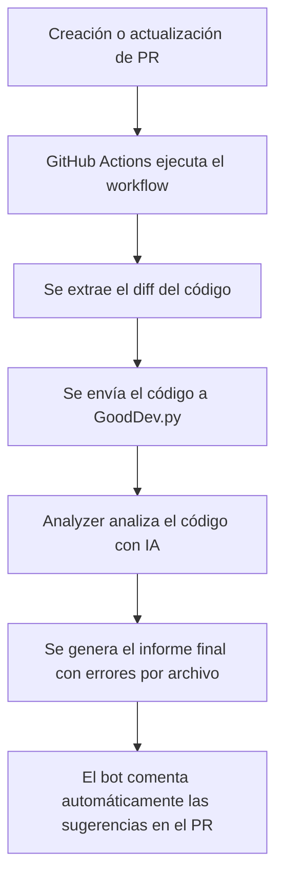

# 🧠 GoodDev — Auditor Inteligente de PR's

**GoodDev** es un sistema automatizado de revisión de código que analiza los **Pull Requests (PRs)** en GitHub para verificar el cumplimiento de **buenas prácticas de desarrollo**.  
Funciona como un **auditor inteligente**, capaz de evaluar código fuente, detectar problemas comunes y sugerir mejoras antes de que se apruebe la fusión.

---

## 🚀 Función Principal

Cada vez que se crea o actualiza un **Pull Request**, GoodDev:

1. Extrae el código modificado (diff del PR).  
2. Lo analiza mediante un modelo de IA (**Gemini**).  
3. Evalúa si el código cumple con las reglas de buenas prácticas definidas.  
4. Clasifica los errores **por archivo** y agrega un **puntaje general** del PR.  
5. Publica automáticamente un **comentario con el informe de auditoría** en el PR.  

De esta forma, **los revisores humanos reciben un análisis técnico completo sin intervención manual.**

---

## 🧩 Implementaciones Futuras

El objetivo a futuro es evolucionar hacia un **agente autónomo ReAct**, con capacidades avanzadas de auditoría de código:

- Analizar PRs y repositorios completos **de manera contextual**, entendiendo la arquitectura del proyecto.  
- Aplicar **razonamiento paso a paso**, combinando conocimiento técnico almacenado (RAG) con razonamiento dinámico (ReAct).  
- **Sugerir automáticamente correcciones** o mejoras en la estructura del proyecto.  
- **Aprender de revisiones pasadas** para mejorar la calidad de sus auditorías con el tiempo.  

---

## ⚙️ Flujo de Trabajo del Auditor



---

## 🧱 Estructura del Proyecto

```
GoodDev/
│
├── src/
│   ├── GoodDev.py                # Script principal del auditor
│   ├── analyzer.py               # Lógica del análisis con IA
│   ├── Utils/
│   │   ├── utils.py              # Funciones auxiliares (leer, limpiar, cachear)
│   └── Rules/
│       ├── rules.txt             # Reglas de buenas prácticas seteada por el equipo
│       ├── contexto.txt          # Contexto general del proyecto seteado por el equipo
│
├── code_changes.txt              # Código modificado (generado por el workflow)
├── code.js                       # Mock de ejemplo para pruebas locales
├── pull_request.log              # Resultado del análisis (comentario al PR)
├── requirements.txt              # Dependencias del proyecto
├── .env.example                  # Ejemplo del archivo de configuración de API Key
└── .github/
    └── workflows/
        └── gooddev.yml           # Workflow central (GitHub Actions)
```

📌 **Nota:**  
`code.js` es **solo un mock** usado para pruebas locales.  
Cuando se ejecuta en un PR real, el workflow genera automáticamente el archivo `code_changes.txt` con los cambios del PR.

---

## 🧠 Instalación Local (para desarrolladores)

1. **Clonar el repositorio:**
   ```bash
   git clone https://github.com/tuusuario/GoodDev.git
   cd GoodDev
   ```

2. **Instalar dependencias:**
   ```bash
   pip install -r requirements.txt
   ```

3. **Configurar tu API Key de Google Gemini:**
   - Crear un archivo `.env` en la raíz del proyecto:
     ```bash
     GOOGLE_API_KEY="TU_API_KEY_AQUI"
     ```
   - También podés copiar el ejemplo incluido:
     ```bash
     cp .env.example .env
     ```


4.##  Integración con GitHub Actions 

GoodDev fue diseñado para **trabajar automáticamente en cada Pull Request**.  
Esto permite que los equipos integren auditorías inteligentes en su pipeline de CI/CD sin configuración manual.

### 📂 Paso 1 — Asegurar estructura
Debe existir el siguiente archivo en tu repositorio:

```
.github/workflows/gooddev.yml
```


### 🔐 Paso 2 — Agregar tu API Key a GitHub Secrets
1. Ir a tu repositorio → **Settings → Secrets → Actions**  
2. Crear un nuevo secret llamado:
   ```
   GOOGLE_API_KEY
   ```
3. Pegar tu clave de la API de **Google Gemini**.

---

## 🧪 Cómo Probar el Auditor en tu Repositorio

1. Crear una rama nueva:
   ```bash
   git checkout -b test-gooddev
   ```
2. Hacer un cambio pequeño en cualquier archivo:
   ```bash
   echo "// prueba del auditor" >> index.js
   git add .
   git commit -m "test: prueba de auditor GoodDev"
   git push origin test-gooddev
   ```
3. Crear un **Pull Request** hacia `main` o `master`.

El workflow se ejecutará automáticamente y dejará un **comentario con el informe completo** y el **puntaje del PR**.

---

Comentar para generar PULL REQUEST